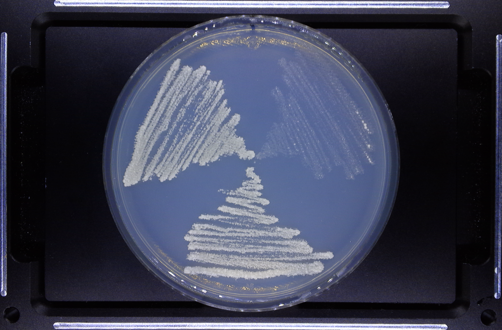
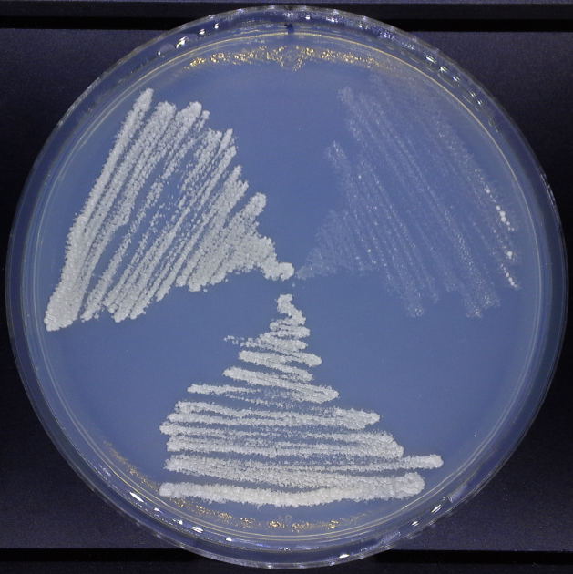
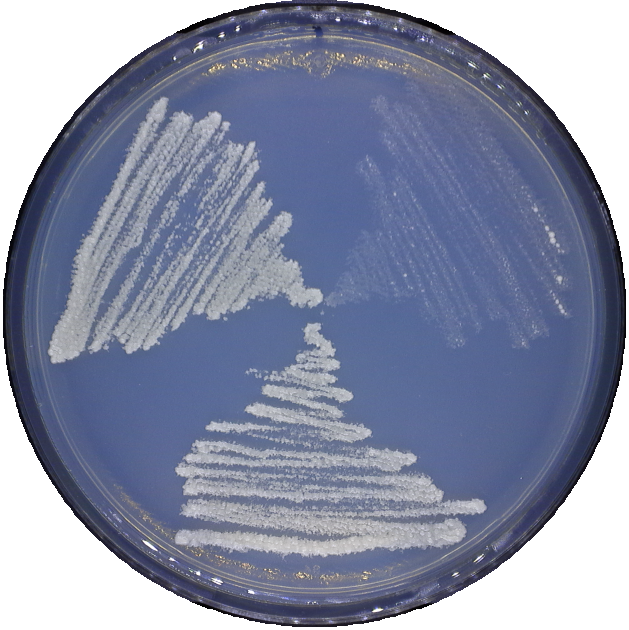
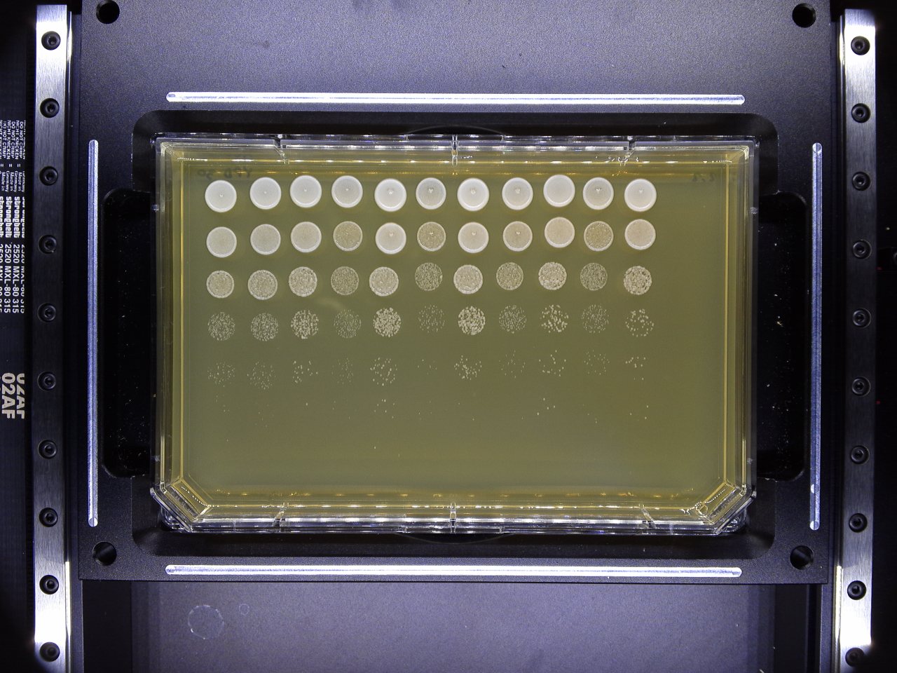
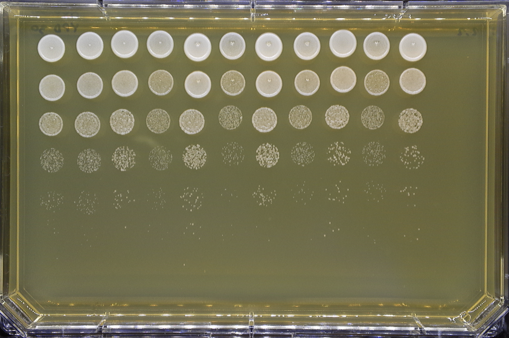

# Crop-mask
Python script to crop images of circular plates (petri dishes) and rectangular omnitray taken using the PhenoBooth.

To use this script you need the python libraries: numpy and PIL

If you don't have one of these two, you can install them using pip (e.g.):

>pip install numpy

>pip install Pillow

Example for a petri dish
this is the original image

after cropping

after masking

Usage

>python crop_circle3_ONE.py FILENAME

This will crop only the FILENAME.png

>python crop_circle3_ONE.py

This will crop all the png files in the folder.

Example for a omnitray
this is the original image

after cropping

Usage

>python crop_omnitray_ONE.py FILENAME

This will crop only the FILENAME.png

>python crop_omnitray_ALL.py

This will crop all the png files in the folder.
